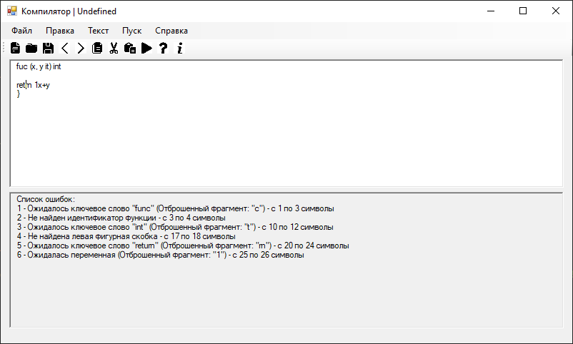
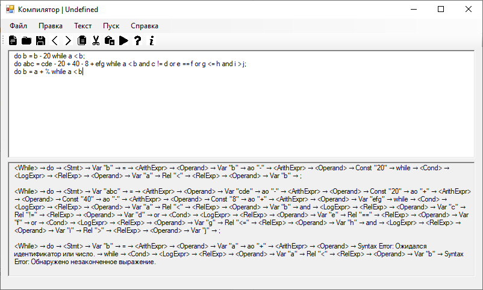

#Руководство пользователя
##Меню
###Файл

При нажатии на кнопку «Создать», в меню «Файл», создастся новый файл. Причем предыдущий файл, который Вы только что редактировали, закроется.
«Открыть» - команда, позволяющая открывать файлы с расширением «.txt». (Новый файл откроется, а предыдущий - закроется.)
Кнопки «Сохранить» и «Сохранить как» различаются только тем, что при нажатии на кнопку «Сохранить» приходится выбирать только один раз то место, 
куда Вы хотите сохранить файл (если файл еще не был сохранен никуда), а при нажатии на «Сохранить как» каждый раз будет открываться диалоговое окно с выбором пути 
для сохранения файла.
Кнопка "Выход" закрывает окно редактора.


###Правка
В меню «Правка» располагаются команды для изменения текста.

«Отменить» отменит последнее действие.
А если надо что-то удалить из текста, скопировав в буфер обмена, то можно воспользоваться кнопкой «Вырезать», после выделения того отрывка текста, 
который нужно удалить и скопировать в буфер обмена.
Команда «Копировать» скопирует выделенный отрывок текста.
Нажимая на кнопку «Вставить», Вы вставляете имеющийся в буфере обмена отрывок текста.
«Удалить» просто удалит выделенный отрывок текста.
"Повторить" повторяет последнее изменение в тексте.
"Выделить всё" выделяет весь текст.


###Пуск
Запускает синтаксический анализатор

###Справка
В этом меню можно узнать информацию о программе.

###"Вызов справки" покажет данное руководство пользователя.
"О программе" покажет версию программы.


##Панель инструментов
Содержит кнопки для быстрого доступа к командам:
-Создать файл
-Открыть файл
-Сохранить файл
-Отменить
-Повторить
-Копировать
-Вырезать
-Вставить
-Пуск
-Вызов справки
-О программе

#2_________________________________________________________
 

##1)Постановка задачи Разработать грамматику. Изучить назначение лексического анализатора. Спроектировать алгоритм и выполнить программную реализацию сканера. Спроектировать диаграмму состояний сканера (примеры диаграмм представлены в прикрепленных файлах). Разработать лексический анализатор, позволяющий выделить в тексте лексемы, иные символы считать недопустимыми (выводить ошибку). Встроить сканер в ранее разработанный интерфейс текстового редактора. Учесть, что текст для разбора может состоять из множества строк. 


##2)Диаграмма сканера


 

3)Пример работы программы


#3-------------------------------------------------------------
#Лабораторная работа 3

##Грамматика G[ ]: 
G:

VT = { ‘func’ ‘return’ ‘int’ ‘a’…’z’ ‘A’…’Z’ ‘0’…’9’ ‘(‘ ‘ ‘ ‘,’ ‘)’ ‘{‘ ‘_’ ‘+’ ‘-‘ ‘*’ ‘/’ ‘}’ }

VN = {DEF, FUNCNAME, FUNCNAMEREM, ARGNAME, ARGNAMEREM, TYPEARG, TYPEFUNC, FUNCOPEN, RETURN, ARG1NAME, ARG1NAMEREM, ARG2NAME, ARG2NAMEREM, END, digit, letter}

P = {

DEF -> 'func' FUNCNAME

FUNCNAME -> (letter | '_') FUNCNAMEREM

FUNCNAMEREM -> (letter | digit | '_') FUNCNAMEREM | '(' ARGNAME

ARGNAME -> (letter | '_') ARGNAMEREM

ARGNAMEREM -> (letter | digit | '_') ARGNAMEREM | ' , ' ARGNAME | TYPEARG

TYPEARG -> 'int' ') ' TYPEFUNC

TYPEFUNC -> 'int' FUNCOPEN

FUNCOPEN -> '{' RETURN

RETURN -> 'return' ARG1NAME

ARGNAME -> (letter | '_') ARGNAMEREM 

ARGNAMEREM -> (letter|digit|'_') ARGNAMEREM | (+ | - | * | /) ARGNAME | END

END -> '}'}


##Примеры верных строк:
 

func add(x, y int)int

{

	return x+y

}


func mul(x, y int)int{


	return x*y

}


##3)Конечный автомат


##Окно вывода: верно и неверно





#4-------------------------------------------------------------
#Лабораторная работа 4

## Лабораторная работа №4: Нейтрализация ошибок (метод Айронса)

**Тема**: нейтрализация ошибок (метод Айронса).

**Цель работы:** реализовать алгоритм нейтрализации синтаксических ошибок и дополнить им программную реализацию парсера.

### Метод Айронса

Разрабатываемый синтаксический анализатор построен на базе автоматной грамматики. При нахождении лексемы, которая не соответствует грамматике предлагается свести алгоритм нейтрализации к последовательному
удалению следующего символа во входной цепочке до тех пор, пока следующий символ не окажется одним из допустимых в данный момент разбора.

Этот алгоритм был мной уже реализован в Лабораторной работе №3. В таблице ошибок выводятся их местоположение и текст ошибки, содержащий информацию об отброшенном фрагменте.

#6-------------------------------------------------------------
#Лабораторная работа 6

Тема: реализация алгоритма поиска подстрок с помощью регулярных выражений.

Цель работы: реализовать алгоритм поиска в тексте подстрок, соответствующих заданным регулярным выражениям.

Задание 1(1-24): Построить РВ, описывающее ОГРН юридического лица.

РВ: \b\d{13}\b


Задание 2(2-23): Построить РВ для поиска аббревиатур

РВ: \b[A-ZА-Я]{2,}\b


Задание 3(3-24): Построить РВ, описывающее время. Формат: ЧЧ:ММ:СС в
24-часовом формате с обязательным ведущим 0

РВ: (?:[01]\d|2[0-3]):[0-5]\d:[0-5]\d


#7-------------------------------------------------------------
#Лабораторная работа 7


Тема: реализация метода рекурсивного спуска для синтаксического анализа.

Цель работы: разработать для грамматики алгоритм синтаксического анализа на основе метода рекурсивного спуска.

Для грамматики G[<While>] разработать и реализовать алгоритм анализа на основе метода рекурсивного спуска.

```
G[<While>]:

<While> ? do <Stmt>  while <Cond>;
<Cond> ? <LogExpr> {or <LogExpr>}
<LogExpr> ? <RelExpr> {and <RelExpr>}
<RelExpr> ? <Operand> [rel <Operand>]
<Operand> ? var | const
<Stmt> ? var as <ArithExpr>
<ArithExpr> ? <Operand> {ao <Operand>}
```

Примечание: while, do, end, and, or – ключевые слова. В тип rel объединили операции сравнения <,<=, >=, >, != и ==, в тип ao арифметические операции + и -, в тип as оператор присваивания =, тип var – название переменной (только буквы), тип const – числа. Причина, по которой не объединены в один тип логические операции and и or заключается в том, что эти операции имеют различный приоритет.

По классификации Хомского данная грамматика относится к КС.

### Примеры

```
do b = b - 20 while a < b; 
do abc = cde - 20 + 40 - 8 + efg while a < b and c != d or e == f or g <= h and i > j ;
 do b = a + % while a < b 
```




