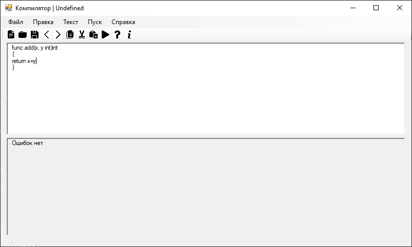

Руководство пользователя
Меню
Файл

При нажатии на кнопку «Создать», в меню «Файл», создастся новый файл. Причем предыдущий файл, который Вы только что редактировали, закроется.
«Открыть» - команда, позволяющая открывать файлы с расширением «.txt». (Новый файл откроется, а предыдущий - закроется.)
Кнопки «Сохранить» и «Сохранить как» различаются только тем, что при нажатии на кнопку «Сохранить» приходится выбирать только один раз то место, 
куда Вы хотите сохранить файл (если файл еще не был сохранен никуда), а при нажатии на «Сохранить как» каждый раз будет открываться диалоговое окно с выбором пути 
для сохранения файла.
Кнопка "Выход" закрывает окно редактора.

Правка
В меню «Правка» располагаются команды для изменения текста.

«Отменить» отменит последнее действие.
А если надо что-то удалить из текста, скопировав в буфер обмена, то можно воспользоваться кнопкой «Вырезать», после выделения того отрывка текста, 
который нужно удалить и скопировать в буфер обмена.
Команда «Копировать» скопирует выделенный отрывок текста.
Нажимая на кнопку «Вставить», Вы вставляете имеющийся в буфере обмена отрывок текста.
«Удалить» просто удалит выделенный отрывок текста.
"Повторить" повторяет последнее изменение в тексте.
"Выделить всё" выделяет весь текст.

Пуск
Запускает синтаксический анализатор

Справка
В этом меню можно узнать информацию о программе.

"Вызов справки" покажет данное руководство пользователя.
"О программе" покажет версию программы.

Панель инструментов
Содержит кнопки для быстрого доступа к командам:
-Создать файл
-Открыть файл
-Сохранить файл
-Отменить
-Повторить
-Копировать
-Вырезать
-Вставить
-Пуск
-Вызов справки
-О программе

2_________________________________________________________
 

1)Постановка задачи Разработать грамматику. Изучить назначение лексического анализатора. Спроектировать алгоритм и выполнить программную реализацию сканера. Спроектировать диаграмму состояний сканера (примеры диаграмм представлены в прикрепленных файлах). Разработать лексический анализатор, позволяющий выделить в тексте лексемы, иные символы считать недопустимыми (выводить ошибку). Встроить сканер в ранее разработанный интерфейс текстового редактора. Учесть, что текст для разбора может состоять из множества строк. 

2)Диаграмма сканера

 

3)Пример работы программы

3-------------------------------------------------------------
Лабораторная работа 3

Грамматика G[ ]: Vt = { ‘func’,‘a’…’z’, ‘A’…’Z’, ‘0’…’9’, ‘,’ , ‘+’, ‘-‘, ‘*‘, ‘/‘, ‘=’ , ‘(’ , ‘)’, ‘{’, '}'}
 
Vn = {ID, ASSIGN, OPENBRACKET, CLOSEBRACKET, INT, COMMA, OPENBRACE, CLOSEBRACE, ENDLINE, RETURN} 

P = { 1. ? ‘func’ ASSIGN 2.ASSIGN ? letter ID 3.ID -> OPENBRACKET 4.OPENBRACKET -> letter ID 5.ID ? (COMMA -> ID -> INT)|INT 6.INT -> CLOSEBRACKET 7.CLOSEBRACKET -> (ENDLINE -> OPENBRACE) | OPENBRACE 8.OPENBRACE -> (ENDLINE -> RETURN)|RETURN 9.RETURN -> CLOSEBRACE|ID 10.ID -> (CLOSEBRACE|'+' ID|ENDLINE 11.ID -> CLOSEBRACE|ENDLINE 12.ENDLINE -> CLOSEBRACE 

Примеры верных строк:
 
func X (x int){return}

func add(x, y int)int
{
	return x+y
}

func mul(x, y int)int{
	return x*y
}

3)Конечный автомат

Окно вывода: верно и неверно

6-------------------------------------------------------------
Лабораторная работа 6

Тема: реализация алгоритма поиска подстрок с помощью регулярных выражений.

Цель работы: реализовать алгоритм поиска в тексте подстрок, соответствующих заданным регулярным выражениям.

Задание 1(1-24): Построить РВ, описывающее ОГРН юридического лица.

РВ: \b\d{13}\b

Задание 2(2-23): Построить РВ для поиска аббревиатур

РВ: \b[A-ZА-Я]{2,}\b

Задание 3(3-24): Построить РВ, описывающее время. Формат: ЧЧ:ММ:СС в
24-часовом формате с обязательным ведущим 0

РВ: (?:[01]\d|2[0-3]):[0-5]\d:[0-5]\d

